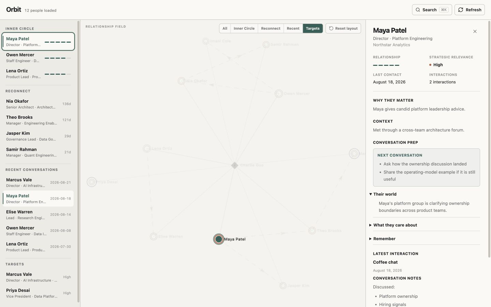

# Orbit

**Remember people. Prepare better conversations.**

Orbit turns local Markdown notes into a private, interactive relationship map. It helps you see who matters, who you have lost touch with, and what to remember before your next conversation—without sending your relationship data to a hosted service.



## Orbit in 30 seconds

- **See your network:** explore a draggable map of people and how they are connected.
- **Know where to focus:** switch between Inner Circle, Reconnect, Recent, and Targets without losing the wider network context.
- **Prepare for a conversation:** open a person card to review their world, what they care about, important details, and useful questions to ask next.
- **Keep control of your data:** people and interaction histories remain human-readable Markdown files on your computer.

Orbit is a focused personal relationship tool, not a sales CRM or social network. The app is read-only: you write or edit notes in Markdown, then use Orbit to explore and act on them.

## Requirements

- [Node.js](https://nodejs.org/) 22 or newer
- npm, which is included with Node.js
- A desktop browser
- A text editor such as VS Code for editing people records

## Start using Orbit

```bash
git clone https://github.com/welkincz/Orbit.git
cd Orbit
npm ci
npm run dev
```

Open [http://127.0.0.1:3000](http://127.0.0.1:3000). Orbit starts with fictional sample people, so you can explore the map immediately.

To make it yours:

1. Edit `data/people/charlie.md` and replace the sample owner information with your own.
2. Edit, duplicate, or remove the fictional records in `data/people/`.
3. Return to Orbit and choose **Refresh**, or reload the browser.

Orbit binds to `127.0.0.1` by default, which means it is available only on the computer running it.

Before adding real information, read the [privacy note](#privacy-and-network-access): people files are ordinary Git-tracked files unless you deliberately keep them out of commits.

## Add your first person

Create one Markdown file per person directly inside `data/people/`. Start with this example:

```markdown
---
id: alex-rivera
name: Alex Rivera
company: Example Studio
team: Product
role: Principal
relationship_strength: 3
strategic_relevance: medium
last_contact: 2026-08-20
desired_cadence_days: 45
inner_circle: false
target: true
tags:
  - product
  - platform
---

# Alex Rivera

## Why they matter

Alex gives thoughtful product advice and understands the platform space.

## Context

We met through a cross-team project.

## Conversation Prep

### Their world

Alex's team is planning its next product cycle.

### What they care about

- Clear ownership and practical decisions

### Remember

- Offered to share their planning template

### Next conversation

- Ask how the new planning process is working

## Interactions

### 2026-08-20 — Coffee chat

Discussed product ownership and team planning.

### Follow up

- Send the platform article.
```

Save the file and refresh Orbit. Select Alex from the sidebar, map, or search to open the conversation card.

## What you can do

### Explore the relationship map

Pan and zoom the map, drag people into useful positions, and select a node to open that person's card. Orbit remembers dragged positions in this browser. **Reset layout** returns the map to its automatic arrangement.

Each visual signal has one job:

- The solar anchor represents you at the center of the network.
- Node size represents relationship strength.
- The outer rim represents strategic relevance.
- Solid lines connect you directly to a person.
- Dashed arrows show introductions between people; selecting either person sends one small motion cue in the introduction direction.

### Focus on the right people

The map and sidebar organize people into four overlapping views:

- **Inner Circle:** the relationships you deliberately mark as closest.
- **Reconnect:** people whose preferred contact cadence is overdue, plus people you have set a cadence for but never contacted (shown as **Never**).
- **Recent:** people contacted within the last 30 days.
- **Targets:** relationships you deliberately want to develop.

Selecting a view highlights matching people with a subtle animated halo. Everyone else remains dimmed but visible, so the surrounding relationship context is never lost.

The sidebar shows the same four views as lists. Each sidebar heading is also a button: it carries the count for that view and focuses the map on it. Press the active heading again to return to the whole network.

### Prepare before reaching out

The person card combines durable context with recent activity:

- why the relationship matters;
- how you know the person;
- their team, priorities, and interests;
- details or commitments worth remembering;
- questions and topics for the next conversation;
- the latest interaction and follow-up items.

The card can be widened when you need more reading space. Use **Open Markdown** to jump to the source file in VS Code, or **Copy path** when another editor is your preference.

### Find anyone quickly

Use the search button or press <kbd>⌘ K</kbd> on macOS / <kbd>Ctrl K</kbd> on Windows and Linux. Search includes names, companies, teams, roles, and tags.

Press <kbd>Esc</kbd> to close the person card; focus returns to the sidebar row you opened it from.

## How your data is organized

Orbit scans Markdown files directly inside `data/people/`. Exactly one file must contain `type: self`; all other files describe contacts.

### Contact fields

| Field | What it controls |
| --- | --- |
| `id` | Required unique lowercase slug, such as `alex-rivera`. |
| `name` | Required display name. |
| `company`, `team`, `role` | Optional professional context. |
| `relationship_strength` | Required number from 1 to 5. |
| `strategic_relevance` | Required value: `low`, `medium`, or `high`. |
| `last_contact` | Optional date in `YYYY-MM-DD` format. |
| `desired_cadence_days` | Optional number of days between intentional check-ins. |
| `inner_circle` | Optional `true` or `false`; defaults to `false`. |
| `target` | Optional `true` or `false`; defaults to `false`. |
| `introduced_by` | Optional ID of the person who made the introduction. |
| `tags` | Optional list used by search. |

Contacts require `relationship_strength` and `strategic_relevance`. The self record does not. Orbit validates records before rendering and shows a file-specific error instead of silently using broken or stale data. When several files are invalid, all of them are listed at once so you can fix them in one pass.

Orbit also shows non-blocking warnings under the header, such as a `last_contact` that is older than the newest interaction in the same file.

### Interaction history

Inside `## Interactions`, add one level-three heading per conversation:

```markdown
### 2026-08-18 — Coffee chat

Discussion notes in Markdown.
```

Orbit shows valid interactions newest first. A `### Follow up` or `### Follow-up` block is displayed separately from the interaction notes.

Inside a section, Orbit renders paragraphs, lists, headings, quotes, code, horizontal rules, and links. Images are deliberately not rendered: loading a remote image would make a network request on behalf of your private notes.

`last_contact` is the primary date when it exists. Otherwise, Orbit uses the newest valid interaction date. All dates are treated as calendar dates so daylight-saving changes do not shift them.

### Conversation Prep

The optional `## Conversation Prep` section recognizes four headings:

- `### Their world`
- `### What they care about`
- `### Remember`
- `### Next conversation`

Any or all may be omitted. When the entire section is missing, the person card can copy an empty template for you. Orbit never writes it into the record automatically.

Keep these notes respectful and useful. Separate known facts from personal observations, avoid unsupported assumptions, and do not store sensitive information that is unnecessary for a better professional conversation.

## Privacy and network access

Orbit has no account, hosted database, analytics service, cloud sync, email ingestion, or calendar ingestion. The application reads the repository's local Markdown files and stores only dragged map positions in the browser's local storage.

> [!IMPORTANT]
> Orbit itself does not upload your people records. However, those records live inside a Git repository, so Git treats edits like any other repository change. Do not commit or push real relationship data unless you intentionally want it stored on the configured remote. A private GitHub repository is still remote storage.

Both development and production commands bind to the IPv4 loopback address `127.0.0.1`. Do not change the hostname to `0.0.0.0`, a LAN address, or another network interface unless you intentionally want to expose the app—and its private relationship data—to other devices.

## Development

```bash
npm run dev          # local development server
npm test             # Vitest test suite
npm run test:watch   # Vitest in watch mode
npm run lint         # ESLint
npm run typecheck    # TypeScript checks
npm run build        # production build
npm run start        # local production server; run after build
```

For a production-style local run:

```bash
npm run build
npm run start
```

The root page is dynamically rendered, so refreshing the production app rereads the current Markdown files without restarting the server.

### Architecture

Orbit uses TypeScript, React, and the Next.js App Router. The server reads and validates `data/people/*.md`, parses known Markdown sections, and sends a serializable people dataset to the client workspace. The client derives the sidebar views and relationship graph from that dataset.

The relationship map uses a client-only canvas. The sidebar, command palette, and detail panel provide accessible DOM alternatives for selecting and reading people. Map positions are optional browser-local UI state and are never written into the Markdown records.

## Current limits

- Desktop-first and repository-scoped.
- Read-only; records are edited in a text editor rather than inside Orbit.
- Markdown changes appear after **Refresh** or a browser reload, not automatically.
- Only direct Markdown files in `data/people/` are scanned.
- Map positions stay in one browser profile and do not sync between devices.
- Canvas nodes are not individual keyboard controls; use the sidebar or command palette for keyboard navigation.
- The **Open Markdown** link depends on VS Code handling `vscode://` links; **Copy path** is the editor-independent fallback and is always available.

## Possible next steps

Ideas intentionally left for future versions include relationship timelines, organization clusters, warm-introduction paths, richer relationship types, local semantic search, suggested follow-ups, calendar or email ingestion, and optional local-LLM features.
